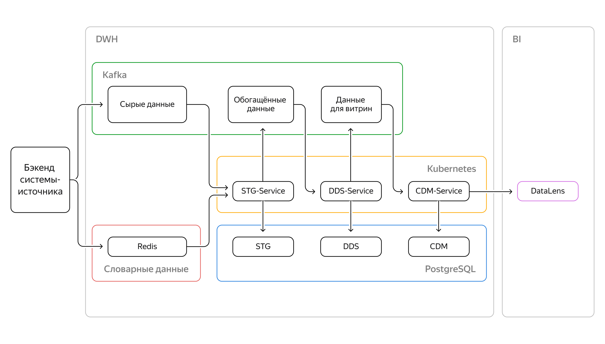
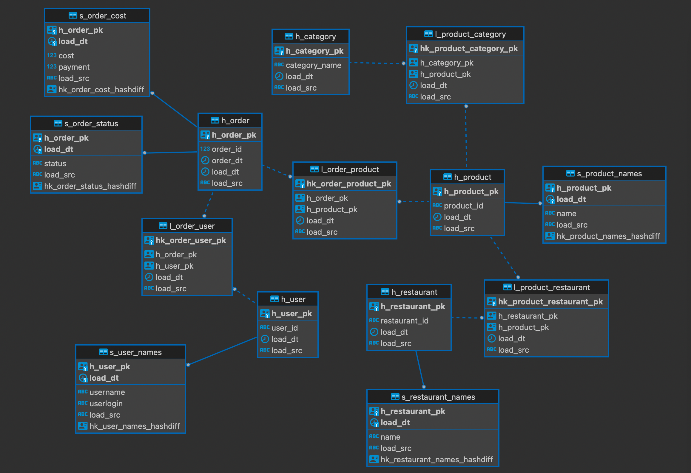

## Описание проекта

Таргетирование пользователей ресторанов на основе статистики по заказам из приложения.

С функциональной точки зрения структура хранилища стандартная: слои STG, DDS, CDM.

Особенности слоёв:

- В STG — исходные данные as is.
- В CDM — две витрины. Первая витрина — счётчик заказов по блюдам; вторая — счётчик заказов по категориям товаров.
- В DDS — модель данных Data Vault.

Данные из системы-источника передаются по двум каналам:

- Первый канал — это поток заказов, который идёт в Kafka (5 заказов в минуту).
- Второй канал — это словарные данные (блюда, рестораны, пользователи), которые идут в Redis.

### Архитектура решения



### Сервисы

#### STG-service

Сообщения на входе из Kafka бэкенда приложения (топик "order-service_orders").

```json
{
  "object_id": 2895816,
  "object_type": "order",
  "sent_dttm": "2023-10-27 05:03:17",
  "payload": {
    "restaurant": {
      "id": "ebfa4c9b8dadfc1da37ab58d"
    },
    "date": "2023-10-20 05:03:39",
    "user": { "id": "626a81ce9a8cd1920641e27d" },
    "order_items": [
      {
        "id": "8d5c4d1598e06f880986abe4",
        "name": "Шурпа из баранины",
        "price": 350,
        "quantity": 2
      },
      {
        "id": "73b5464c81753e4e17adec88",
        "name": "Суп куриный",
        "price": 300,
        "quantity": 1
      },
      {
        "id": "88b343b9b0fd8832deef4760",
        "name": "Казан кебаб с говядиной",
        "price": 500,
        "quantity": 5
      },
      {
        "id": "b92d4d66bc844b7fd7ade634",
        "name": "Плов чайханский",
        "price": 420,
        "quantity": 4
      }
    ],
    "bonus_payment": 0,
    "cost": 7280,
    "payment": 7280,
    "bonus_grant": 0,
    "statuses": [
      {
        "status": "CLOSED",
        "dttm": "2023-10-20 05:03:39"
      },
      {
        "status": "DELIVERING",
        "dttm": "2023-10-20 04:46:32"
      },
      {
        "status": "COOKING",
        "dttm": "2023-10-20 03:53:49"
      },
      {
        "status": "OPEN",
        "dttm": "2023-10-20 03:50:57"
      }
    ],
    "final_status": "CLOSED",
    "update_ts": "2023-10-20 05:03:39"
  }
}
```

#### DDS-service

Сообщение на входе в Kafka STG сервиса (топик "stg-service-orders").

```json
{
  "object_id": 2977218,
  "object_type": "order",
  "payload": {
    "id": 2977218,
    "date": "2023-10-30 14:43:03",
    "cost": 3940,
    "payment": 3940,
    "status": "CLOSED",
    "restaurant": {
      "id": "ef8c42c19b7518a9aebec106",
      "name": "Вкус Индии"
    },
    "user": {
      "id": "626a81ce9a8cd1920641e2b0",
      "name": "Анисимов Макар Филимонович",
      "login": "sevastjan_1997"
    },
    "products": [
      {
        "id": "dd234386b138dfd863c7c7c5",
        "price": 290,
        "quantity": 4,
        "name": "Луковые Бхаджи",
        "category": "Закуски"
      },
      {
        "id": "55084ea193269b89bc1686c4",
        "price": 390,
        "quantity": 5,
        "name": "Машрум Тикка",
        "category": "Закуски"
      },
      {
        "id": "c0d44e02bbe3fa8bf7fcdf85",
        "price": 380,
        "quantity": 1,
        "name": "Чикен Шорба",
        "category": "Супы"
      },
      {
        "id": "dadb4f10954de26867b687b0",
        "price": 450,
        "quantity": 1,
        "name": "Машрум Маттар",
        "category": "Основные блюда"
      }
    ]
  }
}
```

Схема данных DDS сервиса



#### CDM-service

Сообщения на входе из Kafka DDS сервиса (топик "dds-service-orders").

```json
{
  "user_id": "ba2471da-63df-51c9-8b8f-77719ac8fd27",
  "product_id": [
    "3d311716-1af0-55d9-8d47-05825a017cc1",
    "8e91d425-6868-5cb6-8306-9bb6a79936b8",
    "223e3a6f-27f4-5f16-a325-f1b613083fb1",
    "4702c4b7-7adf-56e0-aee8-d226f329eba6"
  ],
  "product_name": [
    "Хачапури по-мегрельски",
    "Чахохбили",
    "Оджахури со свининой",
    "Кубдари с курицей и сыром"
  ],
  "category_id": [
    "9c91163f-a387-5dcc-8265-7ab91050edbd",
    "1beadb7d-ffd7-5fcb-ab93-bdce99728bbc",
    "1beadb7d-ffd7-5fcb-ab93-bdce99728bbc",
    "9c91163f-a387-5dcc-8265-7ab91050edbd"
  ],
  "category_name": ["Выпечка", "Основные блюда", "Основные блюда", "Выпечка"],
  "order_cnt": [1, 3, 4, 4]
}
```
